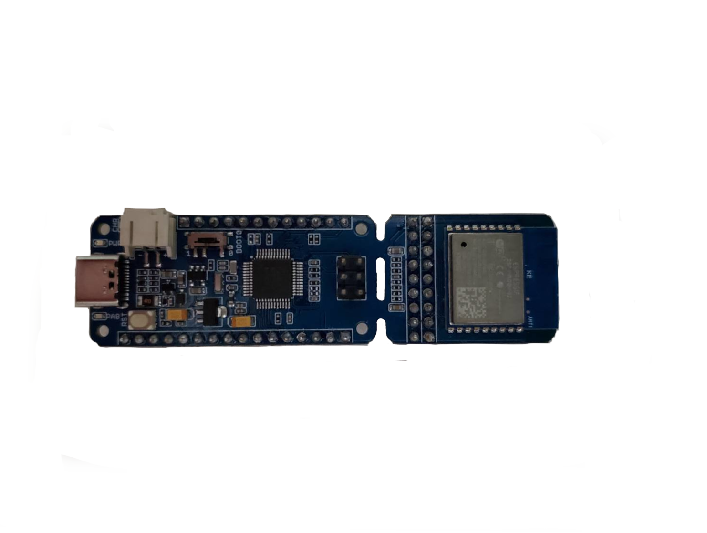

.. _wio_lite_riscv:

Seeed Studio Wio Lite RISC-V
############################

Overview
********

The Seeed Studio Wio Lite RISC-V is an simple and tiny development board with
an GigaDevice GD32VF103 and ESP8266.
More information can be found on:

- `Seeed Studio Wio Lite RISC-V website <https://www.seeedstudio.com/Wio-Lite-RISC-V-GD32VF103-p-4293.html>`_
- `Seeed Studio Wio Lite RISC-V user manual <https://wiki.seeedstudio.com/Wio_Lite_RISC_V_GD32VF103_with_ESP8266/>`_
- `Seeed Studio Wio Lite RISC-V documents <https://github.com/SeeedDocument/Wio-Lite-RISC-V-GD32VF103/tree/master>`_
- `GD32VF103 datasheet <https://files.seeedstudio.com/wiki/Bazaar_Document/GD32VF103_Datasheet_Rev1.0.pdf>`_
- `GD32VF103 user manual <https://files.seeedstudio.com/wiki/Bazaar_Document/GD32VF103_User_Manual_EN_V1.0.pdf>`_

Hardware
********

- 4 x universal 16-bit timer
- 2 x basic 16-bit timer
- 1 x advanced 16-bit timer
- Watchdog timer
- RTC
- Systick
- 3 x USART
- 2 x I2C
- 3 x SPI
- 2 x I2S
- 2 x CAN
- 1 x USBFS(OTG)
- 2 x ADC(10 channel)
- 2 x DAC

Supported Features
==================

The board configuration supports the following hardware features:

.. list-table::
   :header-rows: 1

   * - Peripheral
     - Kconfig option
     - Devicetree compatible
   * - GPIO
     - :kconfig:option:`CONFIG_GPIO`
     - :dtcompatible:`gd,gd32-gpio`
   * - Machine timer
     - :kconfig:option:`CONFIG_RISCV_MACHINE_TIMER`
     - :dtcompatible:`riscv,machine-timer`
   * - Nuclei ECLIC Interrupt Controller
     - :kconfig:option:`CONFIG_NUCLEI_ECLIC`
     - :dtcompatible:`nuclei,eclic`
   * - PWM
     - :kconfig:option:`CONFIG_PWM`
     - :dtcompatible:`gd,gd32-pwm`
   * - USART
     - :kconfig:option:`CONFIG_SERIAL`
     - :dtcompatible:`gd,gd32-usart`
   * - I2C
     - :kconfig:option:`CONFIG_I2C`
     - :dtcompatible:`gd,gd32-i2c`
   * - DAC
     - :kconfig:option:`CONFIG_DAC`
     - :dtcompatible:`gd,gd32-dac`
   * - WIFI
     - :kconfig:option:`CONFIG_WIFI`
     - :dtcompatible:`espressif,esp-at`

Serial Port
===========

Connect to TX0 (PA9) and RX0 (PA10).

Programming and debugging
*************************

Building & Flashing
===================

Here is an example for building the :ref:`blinky-sample` application.

.. zephyr-app-commands::
   :zephyr-app: samples/basic/blinky
   :board: wio_lite_riscv
   :goals: build flash

When using a custom toolchain it should be enough to have the downloaded
version of the binary in your ``PATH``.

The default runner tries to flash the board via an external programmer using openocd.
To flash via the USB port, select the DFU runner when flashing:

.. code-block:: console

   west flash --runner dfu-util

Debugging
=========

You can debug an application in the usual way.  Here is an example for the
:ref:`blinky-sample` application.

.. zephyr-app-commands::
   :zephyr-app: samples/basic/blinky
   :board: wio_lite_riscv
   :maybe-skip-config:
   :goals: debug
